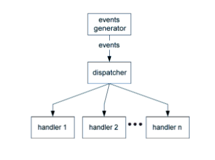
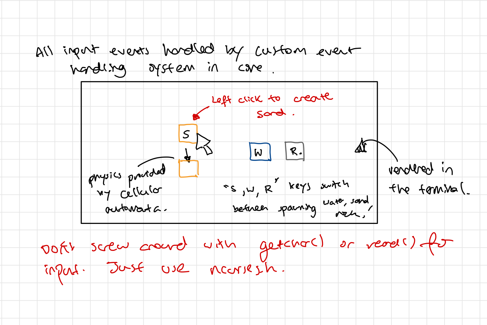

## A Learning Project for Event Driven Programming, in C

Event Driven Programming is a programming paradigm that emerged with the release of Graphical User
Interfaces as a necessary shift in thinking about computer programming.

In this project, I implement the 'Extended Handler Pattern' as shown below as a core library, 
and I use it to create an interactive sand simulation rendered in the terminal. 

## Extended Handler Pattern

The extended handler pattern as shown above is a cornerstone of the Event Driven Programming 
paradigm. I will use this pattern to create a small interactable physics simulation.

- The events generator will be a collection of threads that write to shared memory (an Events Queue)
- The dispatcher will periodically read the Events Queue and call any user defined callbacks

The implementation of the pattern will constitute the 'core' library and the physics simulation 
as well as rendering logic with be part of the 'application'

### Learning outcomes
- Learn and solidify the fundamentals of multithreaded programming in C
- Learn the fundamentals and applications of Event Driven Programming including common patterns, designs, issues etc.
- Learn the architecture behind seamlessly linking Input devices, Game Logic and GUI

## Scope
- The rough scope of the project is summarized in the image below

## Timeline
- I'll give myself about 8 hours total work time

## Resources
- Event Driven Programming by Stepehn Ferg (included below) was my primary resource

## Dependencies
sudo apt install libncurses-dev
:w
